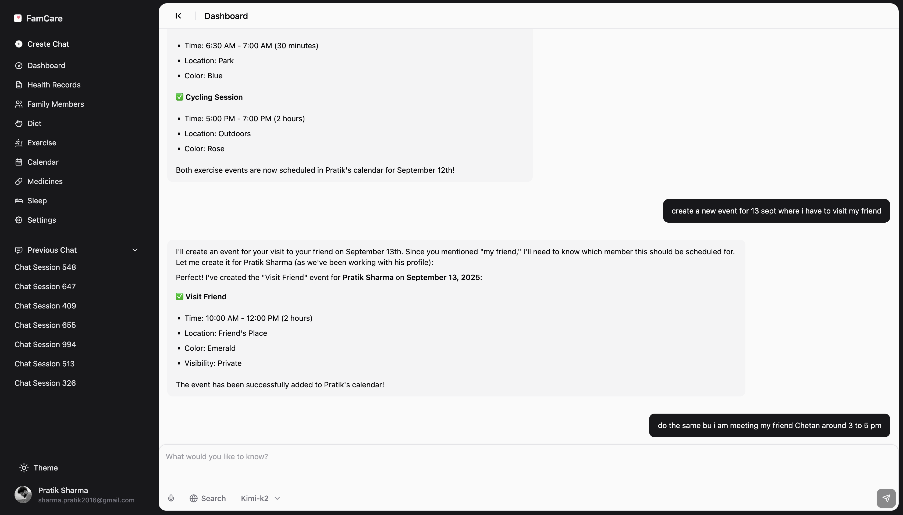
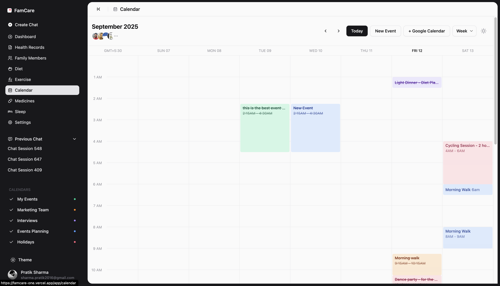
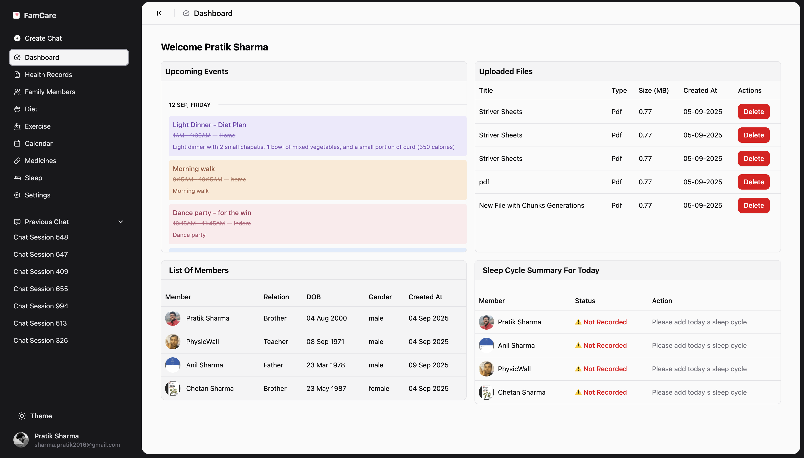
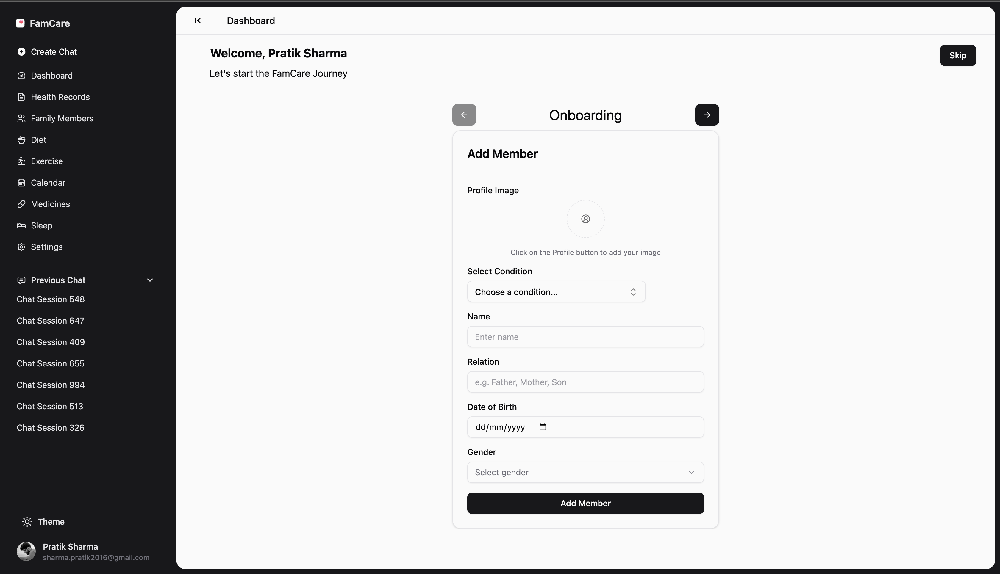
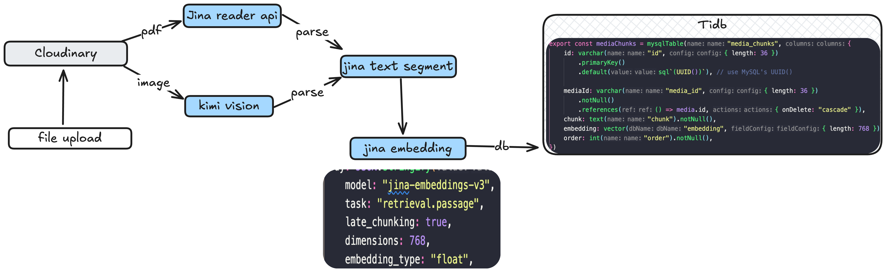
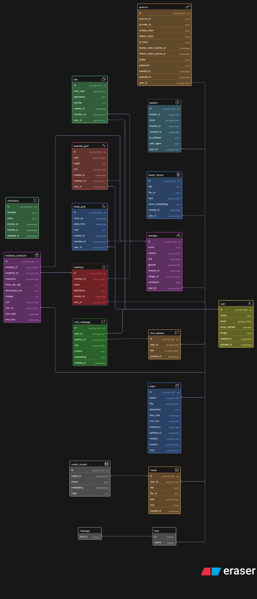

### Problem 
With the Aging population, we are seeing more and more decline in fertility rate, increase in chronic diseases, and increase in healthcare costs. More Importantly, we are seeing a decline in the quality of life, which is leading to more and more people being dependent on others for their daily needs. Now we have a situation where younger ones responsible to look after older family members. Older family members  are facing Chronic diseases like diabetes, hypertension, heart diseases, etc. This requires keep track of complex drugs, schedules, and a healthy lifestyle. The need to have better diet plans, exercises, medicine schedules, keeping track of health records, track sleep patterns, and organizing family activities to avoid loneliness is becoming more and more important. 

### Solution -> FamCare
The Main objective of famcare is to help you organise your health documents, ai chat to better understand records, create medicine scheduling using ai, keeping track of medicines, schedules, diet, exercise and create a calendar, that can be shared with family members. You can download/ add events to your own ics supported calendars like apple, google, notion.  


## Healthcare RAG - famCare







##  RAG System




This is a health management system that uses RAG to answer questions about health.

Features:
1. Add Family Members
2. Add Medicines 
3. Add Health Records/ docs/ pdf
4. Add Medicine Schedule,
5. Add Diet,
6. Add BP, Sugar, Cholesterol, haemoglobin, etc.
7. Add Exercise Goals, 
8. Add Sleep Goals. 
9. Device Integration to get health data from watch, phone, etc. 
10. Chat Features. 
11. Create a Medicine Schedule Calendar. 


## Tech Stack

- Frontend: React, shadcn, tanstack-router, tailwind
- Backend: trpc, drizzle, zod, 
- Database: tidb 
- AI: moonshot ai kimi k2 
- Vector DB: tidb, 
- embeddings : jina ai, 
- parser : jina ai


### DB Schema 





### Installation 

```bash
git clone <this_repo>
cd famcare/apps/client
pnpm install 
```

Add `.env` file in `apps/client`, check out `sample.env`


### Deployment 

You can deploy the app using vercel, netlify, cloudflare, or any node server. As the app uses tanstack start. 


